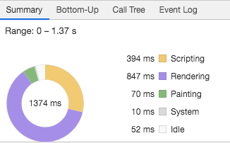
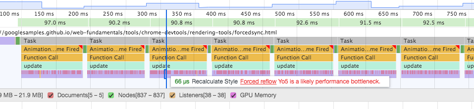
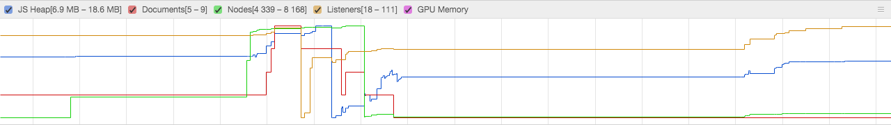
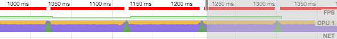

TraceLib
========

This library provides a set of models from the [`devtools-frontend`](https://github.com/ChromeDevTools/devtools-frontend) code base in order to parse trace log files.

__Note:__ This is early development and not ready to be consumed yet!

# Installation

To install the package to your project, run:

```sh
$ npm install --save tracelib
```

# Usage

## `getSummary`

Fetch total time-durations of scripting, rendering, painting from tracelogs.



```js
import Tracelib from 'tracelib'
import JANK_TRACE_LOG from './jankTraceLog.json'

const tasks = new Tracelib(JANK_TRACE_LOG)
const summary = tasks.getSummary()
console.log(summary)

/**
 * output:
 * {
 *   rendering: 847.373997092247,
 *   painting: 69.94999980926514,
 *   other: 9.896000564098358,
 *   scripting: 394.4800021648407,
 *   idle: 52.38300037384033,
 *   startTime: 289959855.634,
 *   endTime: 289961229.717
 * }
```

## `getWarningCounts`

Fetch amount of forced synchronous layouts and styles as well as long recurring handlers.



```js
import Tracelib from 'tracelib'
import JANK_TRACE_LOG from './jankTraceLog.json'

const tasks = new Tracelib(JANK_TRACE_LOG)
const counts = tasks.getWarningCounts()
console.log(counts)

/**
 * {
 *   LongRecurringHandler: 13,
 *   ForcedStyle: 4684,
 *   ForcedLayout: 4683
 * }
 */
```

## `getFPS`

Fetch frames per second.

```js
import Tracelib from 'tracelib'
import JANK_TRACE_LOG from './jankTraceLog.json'

const tasks = new Tracelib(JANK_TRACE_LOG)
const fps = tasks.getFPS()
console.log(fps)

/**
 * {
 * times: [
 *  289959949.734,
 *  289959955.22,
 *  289960052.234,
 *  289960142.388,
 *  289960233.175,
 *  289960324.01,
 *  289960416.646,
 *  289960508.145,
 *  289960600.602,
 *  289960695.329,
 *  289960790.75,
 *  289960882.274,
 *  289960977.634,
 *  289961069.395
 * ],
 * values: [
 *  182.2821727559685,
 *  10.307790628308753,
 *  11.092131244032895,
 *  11.014792866762287,
 *  11.00897231503525,
 *  10.794939328106791,
 *  10.929081197725838,
 *  10.815838712204958,
 *  10.556652274643293,
 *  10.47987340271033,
 *  10.926095888726774,
 *  10.486577179634944,
 *  10.897876006628481,
 *  10.839990888916617
 * ]
 * }
 */
```

## `getMemoryCounters`

Fetch data for JS Heap, Documents, Nodes, Listeners and GPU Memory from tracelogs.



```js
import Tracelib from 'tracelib'
import JANK_TRACE_LOG from './jankTraceLog.json'

const tasks = new Tracelib(JANK_TRACE_LOG)
const memoryInfo = tasks.getMemoryCounters()
console.log(memoryInfo)

/**
 * output:
 * { jsHeapSizeUsed:
 *   { times:
 *      [ 49970556.092,
 *        49970557.846,
 *        49970579.075,
 *        ... 193 more items ],
 *     values:
 *      [ 15307712,
 *        15315152,
 *        15318984,
 *        ... 193 more items ] },
 *  documents:
 *   { times:
 *      [ 49970556.092,
 *        49970987.298,
 *        49970997.59,
 *        49971005.521,
 *        49971062.064,
 *        49971147.013,
 *        49971156.296,
 *        49971196.957,
 *        49971259.352,
 *        49972763.552,
 *        49972764.108 ],
 *     values: [ 6, 7, 8, 9, 8, 6, 7, 6, 5, 6, 7 ] },
 *  nodes:
 *   { times:
 *      [ 49970556.092,
 *        49970570.227,
 *        49970946.325,
 *        ...
 *        49973091.931 ],
 *     values:
 *      [ 4339,
 *        5192,
 *        6727,
 *        ...
 *        4528 ] },
 *  jsEventListeners:
 *   { times:
 *      [ 49970556.092,
 *        49970958.971,
 *        49970987.298,
 *        ...
 *        49972763.552 ],
 *     values:
 *      [ 101,
 *        102,
 *        103,
 *        ...
 *        111 ] },
 *  gpuMemoryUsedKB: { times: [], values: [] } }
 */
```

## `getDetailStats`

Fetch data (timestamp and values) of scripting, rendering, painting from tracelogs.



```js
import Tracelib from 'tracelib'
import JANK_TRACE_LOG from './jankTraceLog.json'

const tasks = new Tracelib(JANK_TRACE_LOG)
const detail = tasks.getDetailStats()
console.log(detail)

/**
 * output:
 * {
 *   rendering: {
 *    times: [ 49970556.092, ..., 49972763.552 ],
 *    values: [1, ..., 5]
 *   },
 *   painting: {
 *    times: [ 49970556.092, ..., 49972763.552 ],
 *    values: [1, ..., 5]
 *   },
 *   other: {
 *    times: [ 49970556.092, ..., 49972763.552 ],
 *    values: [1, ..., 5]
 *   },
 *   scripting: {
 *    times: [ 49970556.092, ..., 49972763.552 ],
 *    values: [1, ..., 5]
 *   },
 *   range: {
 *    times: [ 289959855.634, 289961229.717 ],
 *    values: [ 289959855.634, 289961229.717 ]
 *   }
 * }
```

## `getUserTimingEvents`

Fetch events generated by the [User Timing API](https://developer.mozilla.org/en-US/docs/Web/API/User_Timing_API).

```js
import Tracelib from 'tracelib'
import JANK_TRACE_LOG from './jankTraceLog.json'

const tasks = new Tracelib(JANK_TRACE_LOG)
const events = tasks.getUserTimingEvents()
console.log(events)

/**
 * output:
 * [
 *   {
 *     categoriesString: 'blink.user_timing',
 *     name: 'my measure',
 *     phase: 'b',
 *     startTime: 15794841.042,
 *     args: {},
 *     selfTime: 0,
 *     id: 'blink.user_timing@0xfeee9875',
 *     endTime: 15795241.097,
 *     duration: 400.054999999702,
 *     ordinal: 58
 *   },
 *   {
 *     categoriesString: 'blink.user_timing',
 *     name: 'my mark',
 *     phase: 'R',
 *     startTime: 15794841.051,
 *     args: { data: {} },
 *     selfTime: 0,
 *     id: 'blink.user_timing@0xfeee9875',
 *     ordinal: 59
 *   },
 *   ...
 * ]
 */
```

# Test

To test this package, run:

```sh
$ npm run test
```
